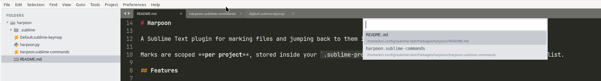

# Harpoon

A Sublime Text plugin for marking files and jumping back to them instantly.

Marks are scoped **per project**, stored inside your `.sublime-project` file, so each project keeps its own independent list.



## Features

- Mark/unmark the current file with one hotkey
- Jump to any mark directly by slot number (1, 2, 3, 4...)
- Browse all marks in a quick panel
- Cycle forward/backward through marks
- Marks persist across restarts
- Search inside the Harpoon list
- Dead marks (deleted or moved files) are pruned automatically

## Installation

1. Open `Preferences > Browse Packages...` in Sublime Text.
2. Create a new folder called `Harpoon`.
3. Copy `Harpoon.py` into that folder.
4. Add the key bindings below via `Preferences > Key Bindings`.

## Recommend

~~Your window should have a saved `.sublime-project` file (`Project > Save Project As...`). Harpoon stores marks inside the project file itself, so without one there's nowhere durable to save them — commands will show an error pointing this out. Easiest way is to install [AutoProject Plugin](https://packages.sublimetext.io/packages/AutoProjects) that will automatically create `.sublime-project`~~

**Update (v1.0.3):** Harpoon now utilizes `window.settings()` to manage your marks. This means data is quietly handled by Sublime's internal session manager and persisted inside your workspace or global session cache. **A `.sublime-project` file is no longer required**-Harpoon works completely out of the box in any ad-hoc window or folder without any setup or sidebar flashing!

## Commands

| Command            | Description                                      |
|---------------------|---------------------------------------------------|
| `harpoon_add`       | Mark the current file, or unmark it if already marked |
| `harpoon_list`      | Show a quick panel of all marks; select to open   |
| `harpoon_goto`      | Jump to a specific mark by slot (`index` arg, 1-indexed) |
| `harpoon_next`      | Cycle to the next mark                             |
| `harpoon_prev`      | Cycle to the previous mark                         |
| `harpoon_clear`     | Clear all marks for the current project            |
| `harpoon_search`    | Search inside Harpoon List                         |

## Suggested key bindings

Add to your `Default.sublime-keymap` (`Preferences > Key Bindings`):

```json
[
    { "keys": ["ctrl+alt+a"], "command": "harpoon_add" },
    { "keys": ["ctrl+alt+e"], "command": "harpoon_list" },
    { "keys": ["ctrl+alt+]"], "command": "harpoon_next" },
    { "keys": ["ctrl+alt+["], "command": "harpoon_prev" },
    { "keys": ["ctrl+alt+d"], "command": "harpoon_clear" },
    { "keys": ["ctrl+alt+f"], "command": "harpoon_search" },

    { "keys": ["ctrl+1"], "command": "harpoon_goto", "args": {"index": 1} },
    { "keys": ["ctrl+2"], "command": "harpoon_goto", "args": {"index": 2} },
    { "keys": ["ctrl+3"], "command": "harpoon_goto", "args": {"index": 3} },
    { "keys": ["ctrl+4"], "command": "harpoon_goto", "args": {"index": 4} }
]
```

Adjust freely — these are just suggestions, not hardcoded defaults. `harpoon_goto` accepts any `index`, so you aren't limited to four slots; add more bindings for `index: 5`, `6`, etc. if you want.

## Usage

1. Open a file you want to keep close at hand.
2. Press your `harpoon_add` key (e.g. `ctrl+alt+a`) to mark it. Press it again on the same file to unmark it.
3. Switch to another file, mark it too. Repeat as needed.
4. Use `ctrl+1`–`ctrl+4` (or your bound keys) to jump straight to a marked file by slot, `harpoon_next`/`harpoon_prev` to cycle through the list in order, or `harpoon_list` to see all marks in a quick panel and pick one.

### How it works

Marks are stored under a `"harpoon_marks"` key inside your window's settings, accessed via Sublime's `window.settings()` API. Because this data is handled directly by Sublime's internal session manager, it is automatically persisted behind the scenes to your `.sublime-workspace` file (if using a saved project) or the global auto-save session cache. This completely avoids manual disk writes to a `.sublime-project` file, keeping your sidebar quiet and your workflow lag-free.

This also means:

* **Isolated Environments:** Marks are strictly bound to the individual window session, ensuring different projects or folders never mix up or share lists.
* **Independent Windows:** Multiple windows running side-by-side maintain completely isolated sets of marks.
* **Zero Setup Required (v1.0.3+):** You no longer need to save a `.sublime-project` file. Marks persist automatically across application restarts for ad-hoc folders and random windows, living safely within Sublime's workspace history.

## Notes

- Marks are stored as absolute file paths. Moving or renaming a project on disk won't break existing marks as long as the paths themselves remain valid; if a file is deleted or moved, its mark is silently dropped the next time you open the list or cycle through marks.
- `harpoon_add` requires the file to be saved (have a path on disk); it won't mark unsaved buffers.